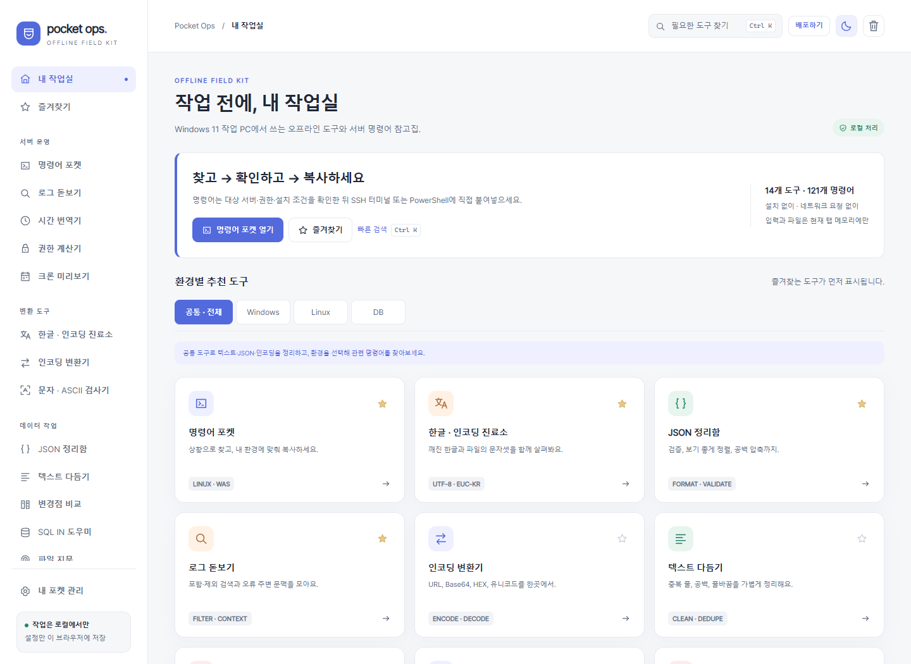

# Pocket Ops

폐쇄망 Windows 작업 PC에서 쓰는 한국어 오프라인 공구함입니다. **HTML 파일 하나**, 도구 14개, 명령어 121개. 설치·서버·인터넷·로그인 없이 실행합니다.

**[v0.2.1 배포 ZIP 받기](https://github.com/seamoon23/pocket-ops/releases/download/v0.2.1/pocket-ops-v0.2.1.zip)** · [상세 사용법](README_KO.md) · [보안 검토](SECURITY_REVIEW.md) · [검증 결과](TEST_REPORT.md)

1. ZIP을 승인된 절차로 반입합니다.
2. 탐색기 → ZIP 우클릭 → **모두 압축 풀기** → `pocket-ops.html` → 승인된 Edge/Chrome으로 엽니다.
3. 왼쪽 **명령어 포켓 → Windows / Linux / DB → 확인·복사**, 또는 도구 선택 → 입력 → 실행 → 결과 복사를 사용합니다.

- JSON·텍스트·로그·SQL IN·인코딩·파일 해시 등 로컬 작업 도구
- Windows PowerShell 5.1, Ubuntu 22.04/RHEL 7 중심 명령어와 기본 도구 대안
- 도구·명령어 통합 즐겨찾기, 키보드 검색, 설정 백업
- 상단 **배포하기**로 현재 버전의 깨끗한 ZIP 저장. 업무 입력·개인 설정은 배포본에서 제외

서버 명령과 SQL을 실행하지 않습니다. 자동 업데이트·외부 통신 기능도 없습니다. 기관의 반입·브라우저 정책과 대상 서버 권한을 확인하세요. 보안 검토는 기관 승인이나 모든 환경의 동작 보증을 의미하지 않습니다.

개발 PC에서 PowerShell → 저장소 폴더를 열고 `python make_data.py`, `python build.py`를 순서대로 실행하면 HTML·ZIP·SHA-256 목록이 생성됩니다. 자세한 개발/시험 경로는 [AGENTS.md](AGENTS.md)에 있습니다.

GitHub → **Actions → Verify offline release**에서 변경마다 실행되는 Windows 검증 결과를 볼 수 있습니다. 개발용 검증 환경에서만 테스트 도구를 설치하며 오프라인 HTML에는 포함하지 않습니다.
